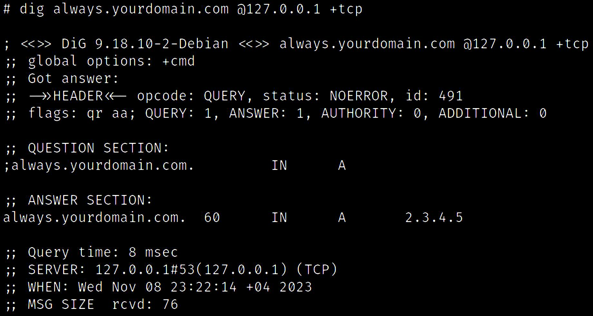
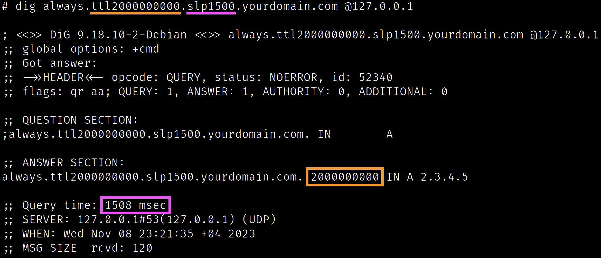

PolarDNS is a specialized authoritative DNS server written in Python 3.x, which allows the operator to produce fully custom DNS responses, suitable for DNS protocol testing purposes.

It can be used for testing of:
- DNS resolvers (server-side)
- DNS clients
- DNS libraries
- DNS parsers and dissectors
- any software handling DNS information

The PolarDNS server supports both UDP and TCP protocols, and it gives the operator full control over the DNS protocol layer.

It can produce variety of non-standard and non-compliant DNS responses, DNS responses violating the RFC specifications, including heavily malformed DNS responses.

This can be useful for:
- Functional testing
- RFC compliance
- Vulnerability research

## Installation

1) Install Python 3.10 or newer.
2) Install PyYAML:
```
pip3 install pyyaml
```
3) Edit the configuration file `polardns.yml` and add your domain and nameserver IP addresses
## How to run it

```
python polardns.py
```
By default, the server starts listening on localhost (127.0.0.1) on UDP and TCP port 53, ready to answer DNS queries.

You can test it by asking the following sample query, which should always resolve to something.

Ask in UDP mode:
```
dig always.yourdomain.com @127.0.0.1
```

Ask in TCP mode:
```
dig always.yourdomain.com @127.0.0.1 +tcp
```

You should receive A 2.3.4.5 record, similarly like in this screenshot:



This indicates that the server is working properly.

## Main concept

By asking the PolarDNS server to resolve something, you are essentially giving it instructions how it should respond to you. This means that you, as a client, dictate the PolarDNS server what kind of response it should produce for you.

For instance, consider the following query:
```
dig always.ttl2000000000.slp1500.yourdomain.com @127.0.0.1
```

You should, again, receive A 2.3.4.5 record, but this time with TTL of 2000000000 (63.4 years) and after a delay of 1.5 seconds:



In the above example, we have used the `always` basic feature (which always resolves to something), and combined it with the `ttl` modifier to adjust the TTL value and the `slp` modifier to actually respond after a delay of 1.5 seconds.

## Main features and response modifiers

There are many built-in features and modifiers to produce variety of different DNS responses. By combining them together, it is possible to produce countless variants of a given response.

This gives PolarDNS capacity to produce highly unusual, abnormal, and even malformed DNS responses, allowing the operator to see how the receiving side handles such situations and whether the receiving side is technically robust and mature.

Some examples of DNS responses which PolarDNS can produce contain:
-	Alias (CNAME) chains and alias loops
-	DNS header malformations (ID, Flags, number of sections)
-	Injection of unsolicited records (cache poisoning)
-	Injection of arbitrary bytes of arbitrary lengths
-	Incomplete / empty / NULL byte(s) responses
-	Compression issues (loops, invalid pointers)
-	Slowly transmitted chunked responses
-	Illegal labels or domain name lengths
-	Arbitrary number of TXT records of arbitrary size
-	Packet length manipulations (TCP)
- Etc.

These can lead to discovery of various vulnerabilities such as:
-	Sloth domain attacks
-	Phantom domain attacks
-	Domain lock-up attacks
-	Cache poisoning
-	Resource exhaustion
-	Crashes, DoS

See the included [catalogue](docs/catalogue/) for the list of all implemented features and response modifiers.

## Adding new features

Adding new features to PolarDNS is essential.

PolarDNS allows you to relatively easily implement a new idea, a test case, feature, a PoC, or a specific scenario that you may want to try.

All you need is a basic / intermediate Python knowledge and knowing a bit of DNS protocol too.

Both can be learned on the go by looking on the PolarDNS code and some of its built-in features.

Plus, [Wireshark](https://www.wireshark.org/) is your very good friend here, along with the [links](#links) below.

## Testing of recursive DNS resolvers

Here's a high-level overview of what you need in order to start testing recursive DNS servers.

1. Purchase a domain e.g., example123.com
2. In the domain registrar, select to manage the domain using your own nameservers (you will need to specify 2 public IPs of your servers)
3. Deploy the PolarDNS authoritative DNS server on both your servers

Now your infrastructure should be ready for testing of any recursive DNS resolver of your choice.

### Testing process breakdown

In order to start testing a target DNS recursive resolver, you have to target your queries to the target DNS resolver, e.g.

```
dig always.example123.com @<TARGET-IP>
```

The target DNS resolver will end up contacting your authoritative PolarDNS nameservers (managing your example123.com domain) to resolve the query.

One of your PolarDNS servers will respond to the target DNS resolver. The target DNS resolver will process the obtained response, and then ultimately will send you the answer.

By instructing the DNS resolver to resolve various subdomains under your example123.com domain, you can effectively test the behavior of the DNS resolver and see how it handles various situations.

For instance, how does it handle a situation when it obtains a non-compliant DNS reply, a reply with an injected record, or a record containing illegal characters, and what kind of answer does it ultimately send to you, the client?

## Links

Here are some great resources which can aid in the testing process.

DNS Protocol related links:
- https://en.wikipedia.org/wiki/List_of_DNS_record_types
- https://www.iana.org/assignments/dns-parameters/dns-parameters.xhtml

DNS servers:
- https://en.wikipedia.org/wiki/Comparison_of_DNS_server_software
- https://www.lifewire.com/free-and-public-dns-servers-2626062
