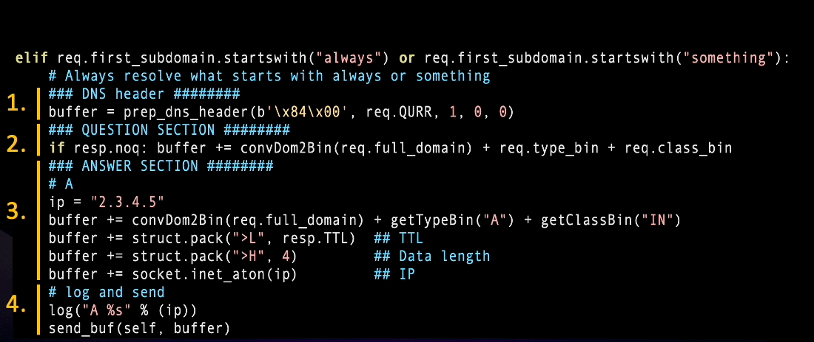

# Crafting DNS Responses

Crafting the actual DNS responses is a crucial part of the process. This is where PolarDNS provides you the flexibility to innovate and experiment freely.

If you examine a few existing features, you'll notice that they are quite similar. Each one essentially constructs a type of DNS response from scratch.

They all share a similar structure that should be maintained for clarity. Essentially, each feature typically contains the following four code sections:

1. Steps to construct the DNS header
2. Steps to construct the QUESTION section
3. Steps to construct the ANSWER section. This is where you will probably make the most changes.
4. Steps to send the packet out and print a message on the console

Here's the actual code for the [`always`](../catalogue/html/always.html) feature, where you can see these sections and what all the code means:

And that should cover most of what you need to start experimenting and implementing your own ideas.

Got an idea or module to share? <g-emoji>&#x1F4A1;</g-emoji>

Help the community grow by contributing your ideas and modules via a pull request (PR)!

---

| Previous: [The process_DNS() Function](process_dns-function) | Next: [Debugging PolarDNS](debugging-polardns)
