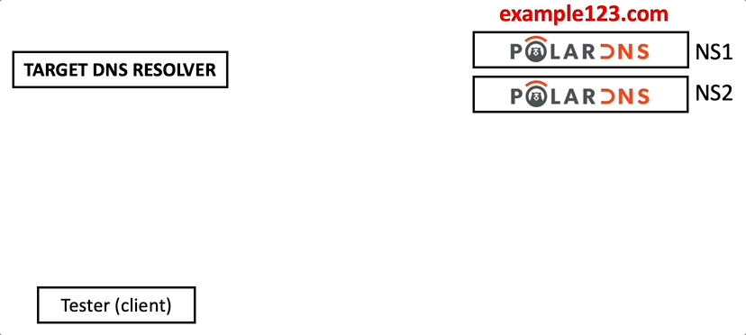

# Testing Process Breakdown

In order to start testing a target DNS recursive resolver, you have to target your queries to the target DNS resolver, e.g.

```
dig always.example123.com @<TARGET-RESOLVER-IP>
```
For example, to test the CloudFlare public DNS:
```
dig always.example123.com @1.1.1.1
```

During the resolution, the target DNS resolver will contact your authoritative PolarDNS nameservers (managing your `example123.com` testing domain) to resolve the query.

One of your PolarDNS servers will respond to the target DNS resolver. The resolver will receive, parse, and process the response from PolarDNS. Afterwards, it will return the final answer to you (the client).

Here’s a visual overview of the testing process:


By instructing the DNS resolver to resolve various subdomains under your `example123.com` domain, you can effectively test the behavior of the DNS resolver and see how it handles various unexpected situations (responses).

For instance, how does it handle a situation when it obtains a malformed DNS response, a response with an injected record, or a record containing illegal characters, and what kind of answer does it ultimately send to you, the client?

---

| Previous: [Testing of Recursive DNS Resolvers](testing-recursive-resolvers) | Next: [Automated E2E Testing with GitHub Actions](github-actions-e2e) |
